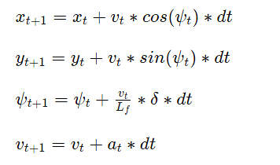

# CarND-Controls-MPC
Self-Driving Car Engineer Nanodegree Program

The goal of this project is to use model predictive control to drive a car in the simulator.

## MPC
### Model State and Update Equations (Vehicle Dynamics)
The 4 components of the state are:

  * x:  x-position
  * y:  y-position
  * ψ:  vehicle orientation
  * v:  velocity
  * Lf: distance between the front of the vehicle and its center of gravity.

### Actuators
Actuators control the system. Here they are

* a: acceleration. In a manual car positive acceleration means using the gas pedal and a negative acceleration means using the brake pedal.
* δ: steering angle. (Steering wheel)

### Errors
cte and errorψ were used to build the cost function for the MPC. The updateequations are:


### N & dt
* N is the number of timesteps the model predicts ahead. A high value for N leads to a further prediction for the future.
* dt is the time difference between two time steps. 
A low dt leads to frequent reevaluations of the actuators and a shorter prediction for the future. 
So ideally we use a small dt for great accuracy and a big value for N to compensate the loss in predicting further.
However, a bigger value for N is computationally more expensive.

### Tuning N and dt
* I started with a time horizon (T=dt*N=0.1*10) of one second and after tuning other parameters the model was able to get through the track. Later on I tried to optimize for speed. Then the model had more difficulty. It seemed like the problem is, that the model can't predict far enough into the future. Consequently, I wanted a longer time horizon and chose a higher value for N and tried 40. This result was much worse and I tried 20 which was great. I also tried values around 20, but 20 had the best results.
* Then I tried to tune dt. Reducing dt to 0.05 lead to driving like a jerk, with values for N smaller than 20 and also N greater than 20. Next, I tried dt=0.2 which seemed unresponsive. The car steered to late.
Due to this testing, I settled on N=20 and dt=0.1. Probably, I haven't found the optimum. There is more potential when tuning N & dt together with other parameters like cte or epte.
Note that the optimum for the parameters, especially N, might be related to the computer hardware. My laptop has no graphic chip and a medium CPU. With less computing power the parameters might need to be adapted conservatively. While more computing power could enable more aggressive driving.


### Other parameters
All parameters are stored in `src/MPC.h`. They were all tuned manually with the compromise of a smooth ride while also going fast.
They could be optimized for a racing style or a more careful ride.


### Latency

In order to simulate a more realistic model of a car, I introduced latency. It should simulate delays in the physical world like a delay in an actuator. To handle this delay like shifted the actual state of the vehicle 100ms into the future.


## Dependencies

* cmake >= 3.5
 * All OSes: [click here for installation instructions](https://cmake.org/install/)
* make >= 4.1
  * Linux: make is installed by default on most Linux distros
  * Mac: [install Xcode command line tools to get make](https://developer.apple.com/xcode/features/)
  * Windows: [Click here for installation instructions](http://gnuwin32.sourceforge.net/packages/make.htm)
* gcc/g++ >= 5.4
  * Linux: gcc / g++ is installed by default on most Linux distros
  * Mac: same deal as make - [install Xcode command line tools]((https://developer.apple.com/xcode/features/)
  * Windows: recommend using [MinGW](http://www.mingw.org/)
* [uWebSockets](https://github.com/uWebSockets/uWebSockets)
  * Run either `install-mac.sh` or `install-ubuntu.sh`.
  * If you install from source, checkout to commit `e94b6e1`, i.e.
    ```
    git clone https://github.com/uWebSockets/uWebSockets 
    cd uWebSockets
    git checkout e94b6e1
    ```
    Some function signatures have changed in v0.14.x. See [this PR](https://github.com/udacity/CarND-MPC-Project/pull/3) for more details.
* Fortran Compiler
  * Mac: `brew install gcc` (might not be required)
  * Linux: `sudo apt-get install gfortran`. Additionall you have also have to install gcc and g++, `sudo apt-get install gcc g++`. Look in [this Dockerfile](https://github.com/udacity/CarND-MPC-Quizzes/blob/master/Dockerfile) for more info.
* [Ipopt](https://projects.coin-or.org/Ipopt)
  * Mac: `brew install ipopt`
       +  Some Mac users have experienced the following error:
       ```
       Listening to port 4567
       Connected!!!
       mpc(4561,0x7ffff1eed3c0) malloc: *** error for object 0x7f911e007600: incorrect checksum for freed object
       - object was probably modified after being freed.
       *** set a breakpoint in malloc_error_break to debug
       ```
       This error has been resolved by updrading ipopt with
       ```brew upgrade ipopt --with-openblas```
       per this [forum post](https://discussions.udacity.com/t/incorrect-checksum-for-freed-object/313433/19).
  * Linux
    * You will need a version of Ipopt 3.12.1 or higher. The version available through `apt-get` is 3.11.x. If you can get that version to work great but if not there's a script `install_ipopt.sh` that will install Ipopt. You just need to download the source from the Ipopt [releases page](https://www.coin-or.org/download/source/Ipopt/) or the [Github releases](https://github.com/coin-or/Ipopt/releases) page.
    * Then call `install_ipopt.sh` with the source directory as the first argument, ex: `sudo bash install_ipopt.sh Ipopt-3.12.1`. 
I had problems installing this library.
In my opinion, the issue is fixed by the following:
1. sudo apt-get install gfortran
2. download the tgz package instead of zip
https://www.coin-or.org/download/source/Ipopt/Ipopt-3.12.7.tgz21
3. unpack
4. sudo bash install_ipopt.sh Ipopt-3.12.7

  * Windows: TODO. If you can use the Linux subsystem and follow the Linux instructions.
* [CppAD](https://www.coin-or.org/CppAD/)
  * Mac: `brew install cppad`
  * Linux `sudo apt-get install cppad` or equivalent.
  * Windows: TODO. If you can use the Linux subsystem and follow the Linux instructions.
* [Eigen](http://eigen.tuxfamily.org/index.php?title=Main_Page). This is already part of the repo so you shouldn't have to worry about it.
* Simulator. You can download these from the [releases tab](https://github.com/udacity/self-driving-car-sim/releases).
* Not a dependency but read the [DATA.md](./DATA.md) for a description of the data sent back from the simulator.


## Basic Build Instructions


1. Clone this repo.
2. Make a build directory: `mkdir build && cd build`
3. Compile: `cmake .. && make`
4. Run it: `./mpc`.

## Tips

1. It's recommended to test the MPC on basic examples to see if your implementation behaves as desired. One possible example
is the vehicle starting offset of a straight line (reference). If the MPC implementation is correct, after some number of timesteps
(not too many) it should find and track the reference line.
2. The `lake_track_waypoints.csv` file has the waypoints of the lake track. You could use this to fit polynomials and points and see of how well your model tracks curve. NOTE: This file might be not completely in sync with the simulator so your solution should NOT depend on it.
3. For visualization this C++ [matplotlib wrapper](https://github.com/lava/matplotlib-cpp) could be helpful.

## Editor Settings

We've purposefully kept editor configuration files out of this repo in order to
keep it as simple and environment agnostic as possible. However, we recommend
using the following settings:

* indent using spaces
* set tab width to 2 spaces (keeps the matrices in source code aligned)

## Code Style

Please (do your best to) stick to [Google's C++ style guide](https://google.github.io/styleguide/cppguide.html).

## Project Instructions and Rubric

Note: regardless of the changes you make, your project must be buildable using
cmake and make!

More information is only accessible by people who are already enrolled in Term 2
of CarND. If you are enrolled, see [the project page](https://classroom.udacity.com/nanodegrees/nd013/parts/40f38239-66b6-46ec-ae68-03afd8a601c8/modules/f1820894-8322-4bb3-81aa-b26b3c6dcbaf/lessons/b1ff3be0-c904-438e-aad3-2b5379f0e0c3/concepts/1a2255a0-e23c-44cf-8d41-39b8a3c8264a)
for instructions and the project rubric.

## Hints!

* You don't have to follow this directory structure, but if you do, your work
  will span all of the .cpp files here. Keep an eye out for TODOs.

## Call for IDE Profiles Pull Requests

Help your fellow students!

We decided to create Makefiles with cmake to keep this project as platform
agnostic as possible. Similarly, we omitted IDE profiles in order to we ensure
that students don't feel pressured to use one IDE or another.

However! I'd love to help people get up and running with their IDEs of choice.
If you've created a profile for an IDE that you think other students would
appreciate, we'd love to have you add the requisite profile files and
instructions to ide_profiles/. For example, if you wanted to add a VS Code
profile, you'd add:

* /ide_profiles/vscode/.vscode
* /ide_profiles/vscode/README.md

The README should explain what the profile does, how to take advantage of it,
and how to install it.

Frankly, I've never been involved in a project with multiple IDE profiles
before. I believe the best way to handle this would be to keep them out of the
repo root to avoid clutter. My expectation is that most profiles will include
instructions to copy files to a new location to get picked up by the IDE, but
that's just a guess.

One last note here: regardless of the IDE used, every submitted project must
still be compilable with cmake and make./

